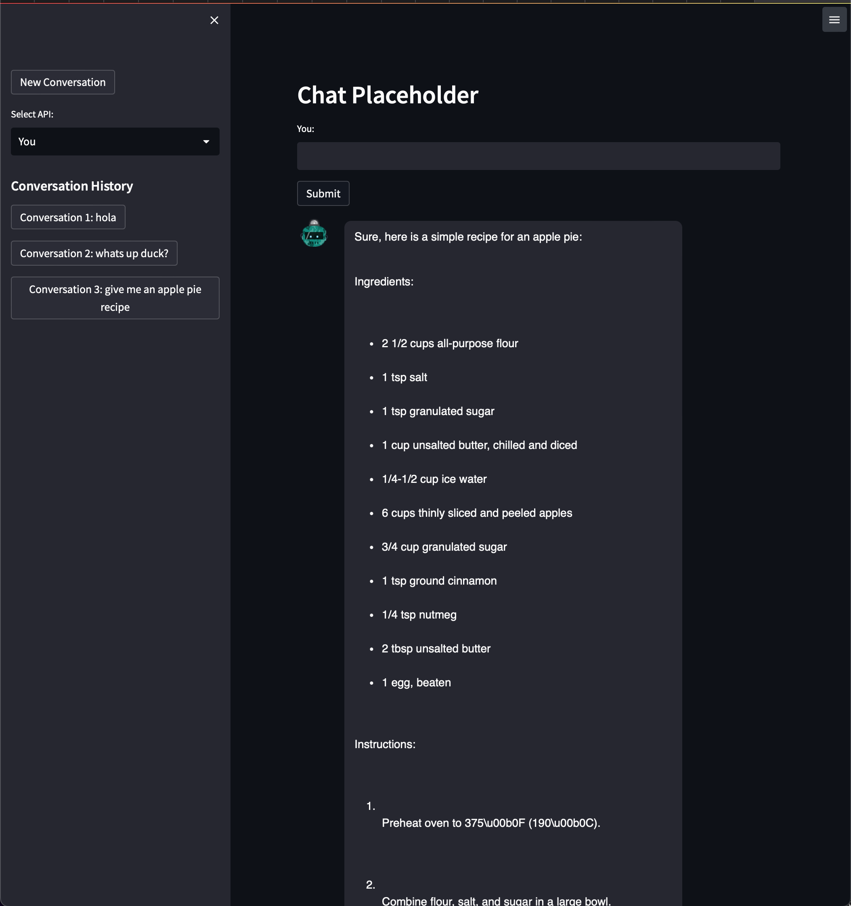

# gpt4free gui

This code provides a Graphical User Interface (GUI) for gpt4free. Users can ask questions and get answers from GPT-4 API's, utilizing multiple API implementations. The project contains two different Streamlit applications: `streamlit_app.py` and `streamlit_chat_app.py`.

In addition, a new GUI script specifically implemented using PyWebIO has been added and can be found in the pywebio-gui folder. If there are errors with the Streamlit version, you can try using the PyWebIO version instead

Installation
------------

1.  Clone the repository.
2.  Install the required dependencies with: `pip install -r requirements.txt`.
3.  To use `streamlit_chat_app.py`, note that it depends on a pull request (PR #24) from the https://github.com/AI-Yash/st-chat/ repository, which may change in the future. The current dependency library can be found at https://github.com/AI-Yash/st-chat/archive/refs/pull/24/head.zip.

Analytics Disclaimer
-----
The streamlit browser app collects heavy analytics even when running locally. This includes events for every page load, form submission including metadata on queries (like length), browser and client information including host ips. These are all transmitted to a 3rd party analytics group, Segment.com.

Usage
-----

Choose one of the Streamlit applications to run:

### streamlit\_app.py

This application provides a simple interface for asking GPT-4 questions and receiving answers.

To run the application:

run:
```arduino
streamlit run gui/streamlit_app.py
```
<br>

   

<br>
<br>

preview:  

    


### streamlit\_chat\_app.py

This application provides a chat-like interface for asking GPT-4 questions and receiving answers. It supports multiple query methods, and users can select the desired API for their queries. The application also maintains a conversation history.

To run the application:

```arduino
streamlit run streamlit_chat_app.py
```

<br>

   

<br>
<br>

preview:  

    

Contributing
------------

Feel free to submit pull requests, report bugs, or request new features by opening issues on the GitHub repository.

Bug
----
There is a bug in `streamlit_chat_app.py` right now that I haven't pinpointed yet, probably is really simple but havent had the time to look for it. Whenever you open a new conversation or access an old conversation it will only start prompt-answering after the second time you input to the text input, other than that, everything else seems to work accordingly.

License
-------

This project is licensed under the MIT License.
