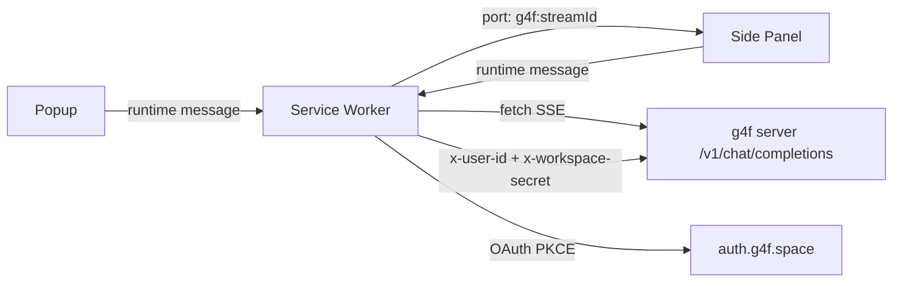

# gpt4free Browser Extension

A Chrome (MV3) extension that brings [gpt4free](https://github.com/xtekky/gpt4free)
into your browser: sidebar chat, page context, image generation, quick actions —
and optional **g4f.space account sign-in** with encrypted conversation cloud sync.

## Features

- 💬 **Side panel chat** — streaming responses with markdown rendering, code copy buttons, abort
- 🖼 **Image generation** — type `/img a red cube` in the panel
- 📄 **Page context** — chat about the current tab or the selected text
- ⚡ **Quick actions** — right-click any selection: Ask / Explain / Translate / Summarize
- 🔐 **g4f.space OAuth** — sign in with GitHub / Discord / HuggingFace (PKCE flow)
- ☁️ **Conversation sync** — conversations stored in the server's secret workspace
  (`/v1/secret/conversations`), AES-256-GCM encrypted at rest
- ⌨️ Shortcuts: `Alt+Shift+G` (open assistant), `Alt+Shift+S` (toggle side panel)

## Setup

1. Start your local gpt4free server:

   ```bash
   python -m g4f --port 1337
   ```

2. Load the extension:
   - Open `chrome://extensions`
   - Enable **Developer mode**
   - Click **Load unpacked** and select this `browser-extension/` folder

3. The extension defaults to the public `https://g4f.space` server. To use your own
   local server, run `python -m g4f --port 1337` and set the server URL to
   `http://localhost:1337` in the extension options (gear icon).

## g4f.space account & cloud sync

Click the **⇧** button in the side panel header (or "Sign in with g4f.space" in Settings)
to connect your account. Sign-in uses the official g4f.space OAuth server
(`auth.g4f.space`) with the PKCE authorization-code flow — your password is never
seen by the extension.

Once signed in:

- Conversations are **automatically pushed** to your account's secret workspace after
  each response (`POST /v1/secret/conversations/sync` with `x-user-id` +
  `x-workspace-secret` headers).
- Use the **⟳** button (or "Sync now" in Settings) for a full two-way sync
  (last-write-wins per conversation by `updatedAt`).
- The workspace secret is derived client-side as
  `SHA-256("<user.id>:<user.secret>")` — the server only ever stores ciphertext
  when the header is present.

> Requires your g4f server to be reachable; sync targets the server configured in
> Settings (local or remote instance exposing the `/v1/secret/*` endpoints).

## Architecture

```
browser-extension/
├── manifest.json            MV3 manifest (permissions, side panel, commands)
├── background/
│   └── service-worker.js    Message router, streaming owner, context menus, OAuth/sync handlers
├── lib/
│   ├── constants.js         Defaults, storage keys, message types
│   ├── storage.js           chrome.storage wrappers (settings + conversations)
│   ├── g4f-client.js        /v1/models, /v1/chat/completions (SSE), /v1/images/generations
│   ├── oauth.js             PKCE sign-in for auth.g4f.space, session storage
│   ├── secret-sync.js       /v1/secret/conversations push/pull/merge
│   ├── markdown.js          Dependency-free markdown renderer
│   └── ui.js                Toasts, copy buttons, spinner
├── popup/                   Toolbar popup (quick actions, mini chat)
├── sidepanel/               Full chat side panel (history, models, /img, account bar)
├── options/                 Settings page (server, chat defaults, account, quick actions)
├── assets/                  Styles (dark theme)
└── icons/                   Generated icons (16–128 px)
```

### Message flow



## Development

No build step — plain ES modules. Reload the extension after edits
(`chrome://extensions` → ↻). Icons are regenerated with PIL (see `scripts/`).

## Roadmap

See [FEATURES.md](FEATURES.md) for the planned feature list.
