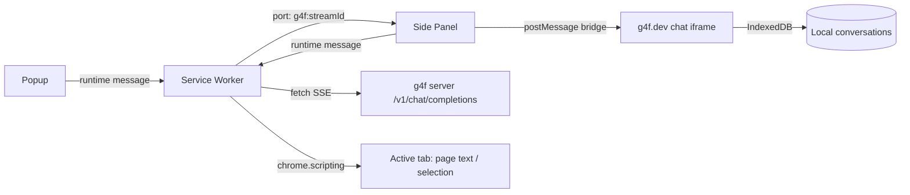

# gpt4free Browser Extension

A Chrome (MV3) extension that brings [gpt4free](https://github.com/xtekky/gpt4free)
into your browser: the **full g4f.dev chat embedded in the side panel**, page
context, image generation, quick actions — with all conversations stored
**locally on your device**.

## Features

- 💬 **Embedded g4f.dev chat** — the complete web chat (model picker, providers,
  files, web search) runs in the side panel. Conversations persist in the chat's
  own IndexedDB, exactly like on g4f.dev.
- 🔁 **Native lite mode** — a lightweight built-in chat (⇆ button) backed by
  `chrome.storage.local`, with a conversation history drawer (☰). Used as a
  fallback when the embed is unavailable, and for popup handoffs.
- 🖼 **Image generation** — type `/img a red cube` in the lite chat
- 📄 **Page context** — chat about the current tab or the selected text
  (checkboxes in the lite chat, or right-click → "Summarize this page")
- ⚡ **Quick actions** — right-click any selection: Ask / Explain / Translate /
  Summarize. The prompt is injected straight into the embedded chat.
- 🧩 **CDP bridge** — let a local g4f server drive this browser as a provider
  (optional, off by default)
- ⌨️ Shortcuts: `Alt+Shift+G` (open assistant), `Alt+Shift+S` (toggle side panel)

> **Privacy:** there is no account, no OAuth and no cloud sync. Conversations
> never leave your browser storage (IndexedDB for the embedded chat,
> `chrome.storage.local` for lite mode).

## Setup

1. Load the extension:
   - Open `chrome://extensions`
   - Enable **Developer mode**
   - Click **Load unpacked** and select this `browser-extension/` folder

2. The embedded chat uses the public `https://g4f.dev` instance by default.
   To point it at your own server, open the chat's settings (gear icon inside
   the embedded chat) or use the extension options to configure the lite chat's
   server URL (e.g. `http://localhost:1337` from `python -m g4f --port 1337`).

## How it fits together

- **Side panel (default)** — an iframe with the chat app. It follows the
  configured server URL: `g4f.space` serves its chat UI from `g4f.dev`, any
  other server (e.g. a self-hosted instance) hosts the chat itself under
  `/chat/`. A small
  postMessage bridge (`g4f-ext:ask` / `g4f-chat:ready`) lets the extension
  inject prompts from context menus and the popup into the embedded chat.
- **Lite chat** — plain ES-module UI with streaming over a port
  (`g4f:<streamId>`), markdown rendering, history drawer, `/img` images.
- **Popup** — quick actions and a mini chat; results are handed off to the
  side panel so they persist in history.

## Architecture

```
browser-extension/
├── manifest.json            MV3 manifest (permissions, side panel, commands)
├── background/
│   └── service-worker.js    Message router, streaming owner, context menus, page extraction
├── lib/
│   ├── constants.js         Defaults, storage keys, message types
│   ├── storage.js           chrome.storage wrappers (settings + conversations)
│   ├── g4f-client.js        /v1/models, /v1/chat/completions (SSE), /v1/images/generations
│   ├── cdp-agent.js         Optional browser-as-provider bridge (chrome.debugger)
│   ├── markdown.js          Dependency-free markdown renderer
│   └── ui.js                Toasts, copy buttons, spinner
├── popup/                   Toolbar popup (quick actions, mini chat → side panel)
├── sidepanel/               Dual-mode panel (embedded g4f.dev chat + native lite chat)
├── options/                 Settings page (server, chat defaults, quick actions, CDP)
├── assets/                  Styles (dark theme)
└── icons/                   Generated icons (16–128 px)
```

### Message flow


```mermaid
flowchart LR
    P[Popup] -->|runtime message| SW[Service Worker]
    S[Side Panel] -->|runtime message| SW
    SW -->|port: g4f:streamId| S
    SW -->|fetch SSE| G[g4f server /v1/chat/completions]
    SW -->|chrome.scripting| T[Active tab: page text / selection]
    S -->|postMessage bridge| C[g4f.dev chat iframe]
    C -->|IndexedDB| L[(Local conversations)]
```

## Development

No build step — plain ES modules. Reload the extension after edits
(`chrome://extensions` → ↻). Icons are regenerated with PIL (see `scripts/`).

## Roadmap

See [FEATURES.md](FEATURES.md) for the planned feature list.
